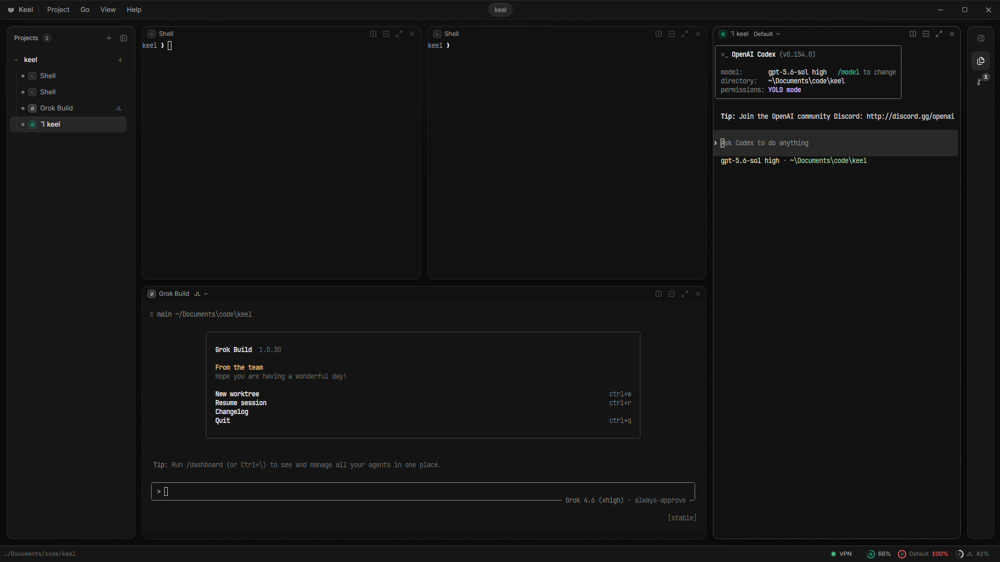

<h1 align="center">Keel</h1>

<p align="center">
  A native desktop workspace for running and organizing multiple AI coding agents at once.
</p>

<p align="center">
  <a href="LICENSE"></a>
</p>

<p align="center">
  
</p>

Keel combines persistent terminal panes, project and deck navigation, an integrated editor, Git tools, agent status, usage information, and workspace restoration in a Tauri application. It uses the agent CLIs already installed on your machine rather than wrapping a hosted agent service.

Built with Tauri 2, React 19, TypeScript, Rust, Vite, CodeMirror, and xterm.js.

## What it does

- Launch multiple supported coding agents and plain shells side by side.
- Group related projects into workspaces in the sidebar; each project keeps its own folders, decks, and terminals.
- Keep processes running while you switch projects or deck layouts.
- Restore saved projects, layouts, terminals, and resumable agent sessions.
- Browse and edit project files with an integrated CodeMirror editor, and search file contents across the project.
- Inspect Git status and diffs, then stage, commit, fetch, pull, push, and manage branches. The file tree and git status refresh from filesystem events, with a mark on files touched in the last few minutes.
- Surface agent activity and supported subscription-usage windows in the workspace UI. An agent that finishes or exits chimes unless its specific terminal has focus, including when you are in another deck, project, workspace, or dialog. Background OS notifications can be muted per pane; sounds still play for muted panes.
- Fade the window while Keel is not focused — enough to see the desktop and other apps behind it, while agents left running stay readable.
- Configure agent commands, profiles, colors, and discovery paths from the app.
- On Windows, optionally route Keel traffic through an isolated OpenVPN tunnel without replacing the machine's preferred default route.

## Requirements

- Node.js 22 or newer
- pnpm 11 or newer
- A Rust toolchain with `rustfmt` and `clippy`
- The native prerequisites required by Tauri for your operating system

On Windows, Tauri requires the Microsoft C++ build tools and WebView2 runtime. The optional private-VPN feature additionally requires the OpenVPN community client and its Interactive Service. See the [Tauri prerequisites](https://tauri.app/start/prerequisites/) for platform setup.

## Development

```sh
corepack enable
pnpm install
pnpm doctor
pnpm dev
```

`pnpm dev` starts the native Tauri app with frontend hot reload. For frontend-only work that does not call Tauri commands, use `pnpm dev:web`.

## Build

```sh
pnpm build:app       # native app plus platform installers/bundles
pnpm build           # native release binary without installer bundles
pnpm build:app:debug # debug-shaped bundle for troubleshooting
```

Build outputs collected for distribution are copied to `release/`. Release binaries are currently unsigned, so operating-system reputation or signing warnings can appear until a release signing process is configured.

## Quality checks

```sh
pnpm check
```

The check runs TypeScript type checking, frontend tests, Rust formatting verification, Clippy with warnings denied, and `cargo test`. CI runs the same command on Windows.

Useful individual commands:

```sh
pnpm typecheck
pnpm test
pnpm rust:fmt
pnpm rust:lint
pnpm test:rust
```

## Using Keel

Add a folder to create a project, then open terminals or agent sessions inside it. Related projects can be grouped into a workspace so they sit together in the sidebar; dissolving a workspace never deletes its projects. Projects can contain multiple decks: independent pane layouts whose processes continue running while another deck is visible. The overview (`Ctrl+O`) shows every deck and lets you move running terminals between them.

Adding terminals arranges the current deck in a balanced grid: three panes form two above one, four form a 2×2 grid, and larger groups spread evenly across rows. The launch preview includes existing panes. Running sessions and editor tabs stay open; explicit horizontal and vertical splits still divide the pane you choose. See [terminal layout](docs/terminal-layout.md) for the placement rules.

Common shortcuts:

| Shortcut | Action |
| --- | --- |
| `Ctrl+P` | Go to a terminal, deck, or action |
| `Ctrl+Shift+F` | Find in files |
| `Ctrl+F` | Find in the focused editor or terminal scrollback |
| `Ctrl+T` | Add terminals |
| `Ctrl+W` | Close the focused pane |
| `Ctrl+1…9` | Jump to a deck |
| `Ctrl+O` | Open deck overview |
| `Ctrl+N` | Create a deck |
| `Ctrl+Shift+D` / `Ctrl+Shift+S` | Split right / split down |
| `Ctrl+Tab` / `Ctrl+Shift+Tab` | Focus next / previous pane |
| `F8` | Focus the next waiting agent |
| `F11` | Toggle focused-pane fullscreen |
| `F2` | Rename the focused item |

## Local data

Keel stores workspace state and agent overrides in the operating system's application-config directory for the `com.alede.keel` identifier. Typical locations are `%APPDATA%\com.alede.keel` on Windows, `~/.config/com.alede.keel` on Linux, and `~/Library/Application Support/com.alede.keel` on macOS.

The main files are:

- `keel.json` for projects, workspaces, decks, layouts, and saved terminal state.
- `agents.json` for changes to the built-in agent catalogue.

Keel can read credentials already managed by supported local agent CLIs when fetching usage information. Those credentials are not repository configuration and should never be committed to this project.

## Repository layout

```text
src/                    React frontend
src-tauri/              Rust backend and desktop packaging
src-tauri/agents.default.json
                        built-in agent catalogue
scripts/                build, artifact, doctor, and cleanup tooling
docs/                   contributor-facing design notes
```

The Windows private-VPN design and its isolation boundaries are documented in [docs/vpn-windows-design.md](docs/vpn-windows-design.md).

## Contributing

See [CONTRIBUTING.md](CONTRIBUTING.md) before opening a pull request. Changes should keep `pnpm check` green and avoid committing generated output, local credentials, private configuration, or machine-specific paths.

Security-sensitive reports should follow [SECURITY.md](SECURITY.md) rather than a public issue.

## License

Keel is available under the [MIT License](LICENSE).
